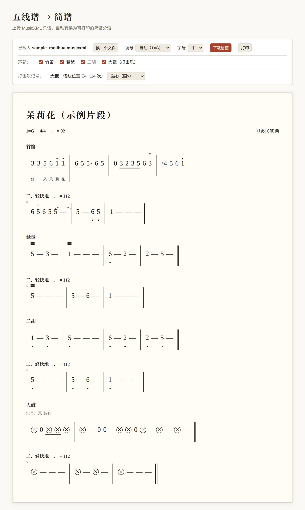

# musicxml-to-jianpu · 五线谱转简谱

把 **MusicXML** 乐谱（`.mxl` / `.musicxml` / `.xml`）转换成**简谱**。

生成的是一个**独立的网页**：可以勾选声部、改调号、给每位团员单独下载分谱，再用浏览器打印或存成 PDF。所有转换都在浏览器本地完成，**乐谱不会上传到任何地方**。



> 图中是内置的示例片段（江苏民歌《茉莉花》），演示了歌词、连音线、三连音、颤音（tr）、琵琶轮指和打击乐记号。

最初是为民乐团的分谱制作而做的，所以对民乐的声部（弹拨乐、笛类、打击乐）有专门的处理，但普通的管弦乐、合唱谱同样可以用。

## 怎么用

### 1. 直接在浏览器里用（最简单，不需要 Claude）

双击打开 [`skills/musicxml-to-jianpu/assets/jianpu-template.html`](skills/musicxml-to-jianpu/assets/jianpu-template.html)，把乐谱文件拖进去即可。页面上有「先看一个示例」按钮，可以先体验一下。

### 2. 命令行

需要 Python 3，只用标准库，不用安装任何依赖：

```bash
# 生成一个"打开就显示简谱"的网页
python3 skills/musicxml-to-jianpu/scripts/build_jianpu.py 乐谱.mxl -o 输出目录/

# 只预选某几个声部（名称按"包含"匹配，也可以写声部 id）
python3 skills/musicxml-to-jianpu/scripts/build_jianpu.py 乐谱.mxl --parts "二胡,曲笛" -o 二胡分谱.html

# 只看乐谱里有什么（声部、调号、拍号、变调变拍、打击乐音色……）
python3 skills/musicxml-to-jianpu/scripts/build_jianpu.py 乐谱.mxl --summary-only
```

### 3. 作为 Claude 的 Skill

装好之后，直接对 Claude 说"把这个 mxl 转成简谱"，或者"只给我做二胡的分谱"，它会自己完成，并把网页交给你。

- **Claude.ai**：把 `skills/musicxml-to-jianpu` 文件夹压缩成 zip（zip 的根目录必须是 `musicxml-to-jianpu` 文件夹本身），然后进入 Customize → Skills，点「+」→「Create skill」上传。需要先在设置里开启代码执行功能。
- **Claude Code**：把 `skills/musicxml-to-jianpu` 文件夹复制到 `~/.claude/skills/`（所有项目可用），或复制到项目里的 `.claude/skills/`（只对该项目可用）：
  ```bash
  cp -r skills/musicxml-to-jianpu ~/.claude/skills/
  ```

> 从 MuseScore / Sibelius / Finale 等打谱软件里，选「导出 → MusicXML」（保存为 `.mxl` 或 `.musicxml`）即可得到输入文件。PDF 和图片乐谱不能直接转换，需要先用乐谱识别（OMR）软件转成 MusicXML。

## 功能

- **首调唱名**：1 = 谱面调号的主音；小调曲目按关系大调记谱（国内简谱通行做法）；可在页面里改调号。
- **基本记谱**：数字 1–7、八度点、升降号、时值下划线、附点、延长线"—"、休止符 0。
- **常见记号**：连音线/圆滑线、三连音、倚音、反复记号和房子、变调和变拍处的标记、歌词。
- **多声部**：勾选要显示的声部；「下载谱面」把当前勾选的声部保存为独立网页，双击打开后按 ⌘P / Ctrl+P 即可打印或存成 PDF。只勾一个声部再下载，就是给单个团员的分谱。
- **按声部名称识别乐器**：弹拨乐（琵琶、柳琴、阮、扬琴、古筝等）的倚音改记为音符上方三道横线（轮/滚奏）；笛类的倚音改记为 tr（颤音）。
- **自动分乐章**：双纵线、终止线、分页处，或带编号的标题文字（如「三、」「2.」「III.」），全谱统一分段，每个声部显示相同的乐章标题与新速度。每 5 小节标注小节号。
- **速度标记**（rit.、渐慢、节拍器记号）出现在每个声部；pizz.、滑奏等乐器专属标记只保留在对应声部。

### 打击乐记号

无音高的打击乐音符记作 ×，并可以区分音色：

| 乐器 | 记号 |
|---|---|
| 鼓（鼓心） | 带圈的 ⊗ |
| 鼓（鼓边） | 普通 × |
| 木鱼（高音） | × 上加点 |
| 木鱼（低音） | × 下加点 |
| 木鱼（高低同时敲） | × 上下各加一点 |

每个打击乐声部下方会标出图例。哪个音色算鼓心/鼓边、高/低，程序按乐器名称（如 High / Low、rim）和使用频率自动判断；判断不对时，可以在页面的「打击乐记号」一行为每个音色手动指定。

## 已知局限

- **不显示的记号**：力度（p、f 等）、渐强渐弱、重音、断奏、延长记号（fermata）、波音和回音等装饰音。装饰音里只处理颤音（tr）、波浪线和轮奏。
- 同一声部里的多个 voice（例如双谱表乐器）按 voice 各占一行。
- 只支持 partwise 格式的 MusicXML（多数打谱软件默认就是）；不做乐谱识别。
- 需要较新的浏览器（读取 `.mxl` 压缩包用到浏览器内置的解压功能）。
- 性能：一份 18 声部、169 小节的总谱，在 Chrome 中约 1 秒内渲染完；更大的乐谱没有测试过。

欢迎通过 Issue 反馈问题，最有帮助的是附上一小段能复现问题的 MusicXML。

## 隐私与版权

- 转换全部在浏览器本地完成，不会上传任何文件。
- 本工具只做格式转换。乐谱本身的版权属于原作者或出版方，请在你有权使用的前提下转换和分发。

## 项目结构

```
skills/musicxml-to-jianpu/
├── SKILL.md                      # Skill 说明（给 Claude 看的）
├── assets/jianpu-template.html   # 转换器本体：单个 HTML 文件，无任何外部依赖
├── scripts/build_jianpu.py       # 校验输入、打印摘要、把乐谱嵌进页面
└── evals/evals.json              # 测试用的提示词
```

转换和排版逻辑都在 `jianpu-template.html` 里。修改时请保留 `<!--EMBEDDED_SCORE-->` 占位符和文件末尾的「embedded score」脚本，构建脚本依赖它们。

## English

**musicxml-to-jianpu** converts MusicXML scores (`.mxl`, `.musicxml`, `.xml`) into *jianpu* (简谱, Chinese numbered musical notation). The result is a single standalone HTML page where you can pick parts, change the key, download individual parts and print or save them as PDF from the browser. Everything runs locally in the browser; no score is uploaded anywhere.

It works in three ways: open `skills/musicxml-to-jianpu/assets/jianpu-template.html` in a browser and drop a score onto it; run `scripts/build_jianpu.py` from the command line (Python 3, standard library only); or install the folder as a Claude Skill. Input must be MusicXML (partwise). PDFs and images need OMR first. See "已知局限" above for the notation that is not rendered (dynamics, accents, fermatas, mordents, etc.).

## 许可

[MIT](LICENSE) © 2026 Lizhou Ding
